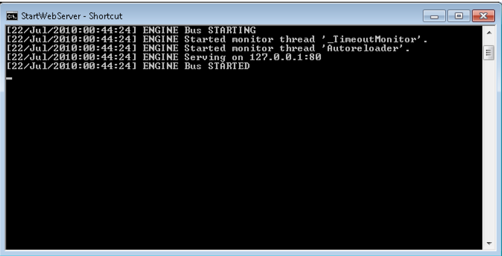
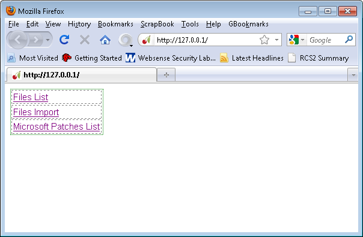
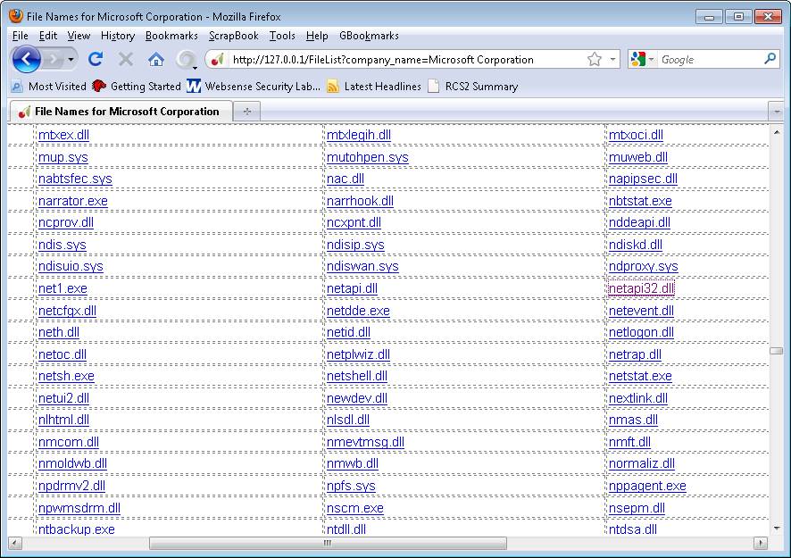
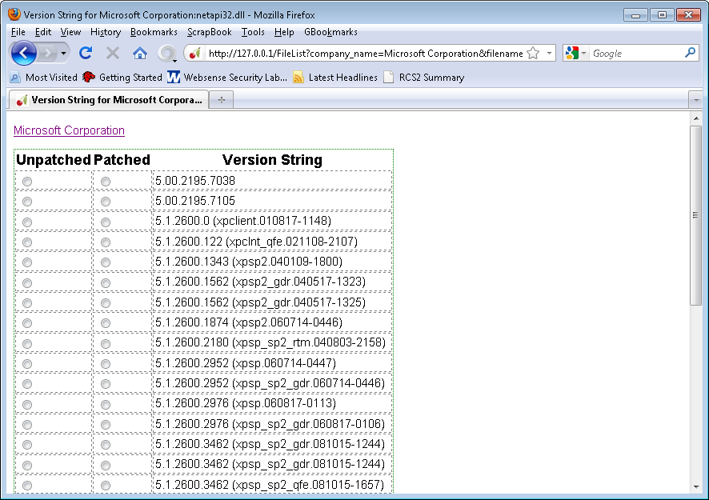
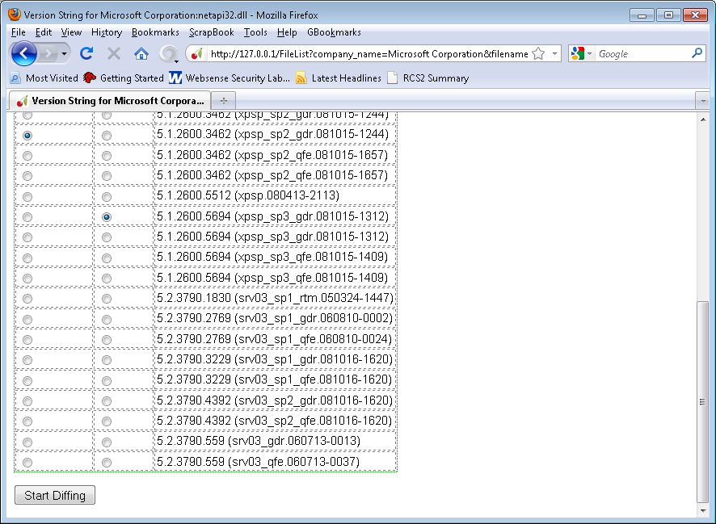
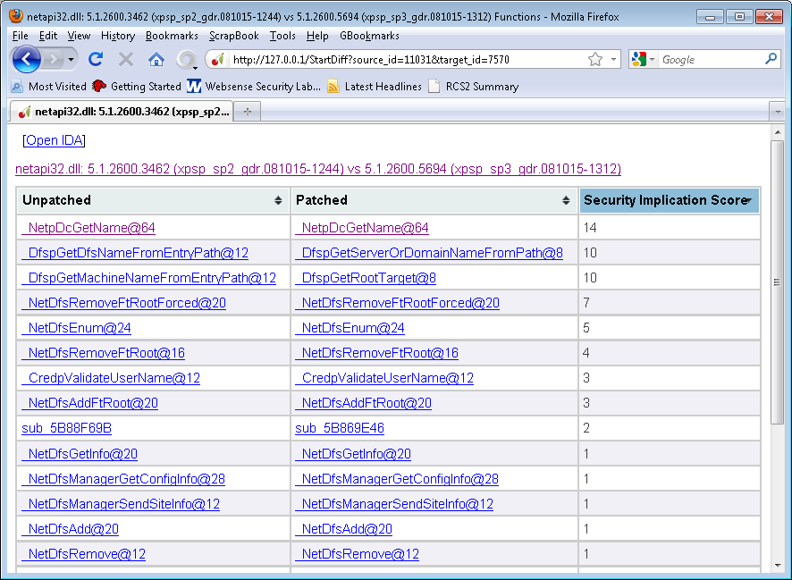
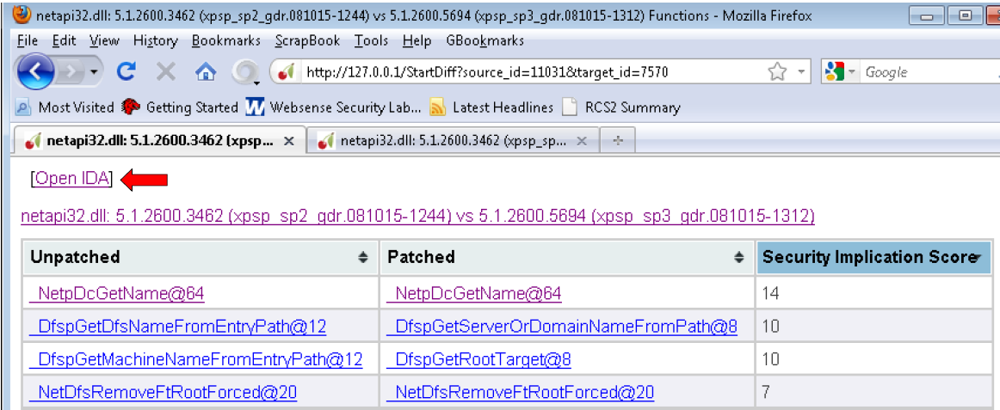
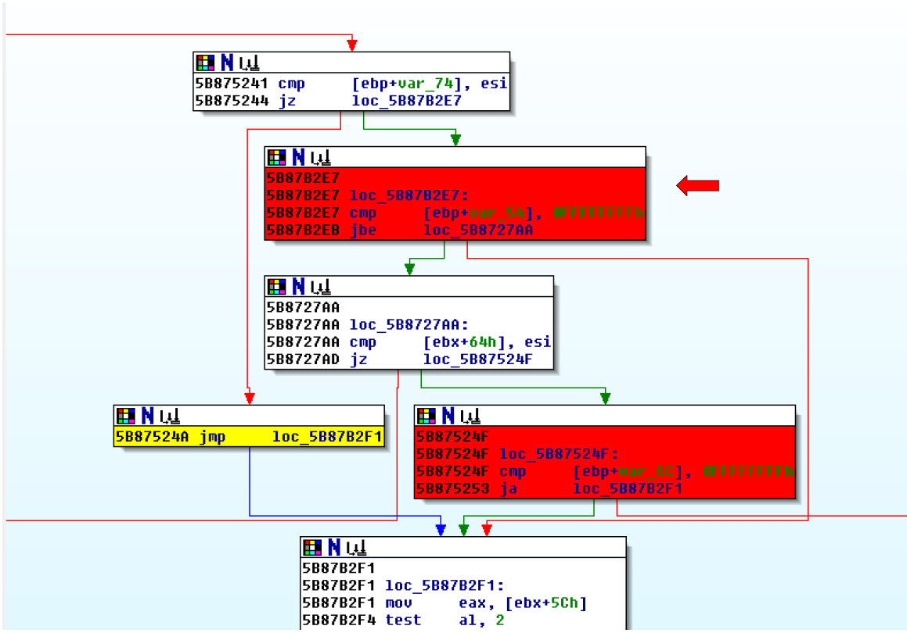

# DarunGrim

## Prerequisites

* IDA 7.x - supporting of IDA 7.x is undergoing

### Using Python Script

If you are going to use python source code for execution, you need to install following Python distribution and Python modules. The other versions might work, but this is the exact packages we tested. This Python and Python module installation is not necessary if you are using the compiled package we provide.

[Python 2.6.5](http://www.python.org/ftp/python/2.6.5/python-2.6.5.msi)
[SQLAlchemy 0.6.3](http://www.sqlalchemy.org/download.html)
[CherryPy 3.1.2](http://download.cherrypy.org/cherrypy/3.1.2/)
[Mechanize 0.2.2](http://wwwsearch.sourceforge.net/mechanize/)
[BeautifulSoup 3.1.0](http://www.crummy.com/software/BeautifulSoup/)
[Mako 0.3.4](http://www.makotemplates.org/download.html)

## Build

Download and install [Visual Studio 2019](https://visualstudio.microsoft.com/vs/) to build the projects.

### Web Browser
Any web browser will work except lynx, but we found that Mozilla Firefox is the best in rendering the results as we intended. IE is good, but sometimes it needs you some patience displaying big size table.

### Starting the DarunGrim3 Server
Start DarunGrim3Server.exe from binary directory. If you're trying python source code distribution, execute DarunGrim3Server.py from the source directory.
If you start the server, you will see the Darungrim3 Webserver starting.

The default binding TCP port is 80. You can change the port by editing DarunGrim3.cfg in the line looks like following.

[Global]
Port = 80

### Main Menu
You can see the first page with 3 menus. With first run, there will not be anything to analyze.So you need to import files first. Click “Files Import” link.

### Importing
You will see an input box, you can put any local folder name to import PE files. I recommend testing by importing “c:\windows” directory which contains pretty much every system files.

If you click “import”, it will start importing files. If the process takes too long, the session will be timed out. But when it times out, don't reload the page because it will trigger the import action again which is unnecessary.

### List of Company Names
You go back to main menu, by connecting to the root URI and select “Files List” menu. It will display the company names of the all the files.

Probably you might be interested in patches from Microsoft, Adobe or Sun. For example, to check Microsoft's binaries, just click “Microsoft Corporation” link.

### List of Files
The next page will display every files that were collected under the selected company name.  You just need to click the name of the file you are interested in. I want to diff netapi32.dll for the analysis example. The file is known for having good history of vulnerabilities.

### List of Version strings  for the file
It will display all the different versions of the file that were collected from the system. It'll display many different versions of the same file. This is possible because when installing patches, Microsoft usually leaves original file in some directory. So by just collecting binaries from a machine that is fully patched, you have a good chances of collecting many versions of the patched files.

You can choose the versions you want to compare with by clicking the radio buttons.

### Initiating Diffing Process
After choosing the files to compare, press “Starting Diffing” button.

### Analysis Results
It takes few minutes to finish the analysis. After that you can see the list of functions that has been modified. You can sort by the columns like “Security Implication Score”

### Function Level Analysis
If you click the function names from the previous view, you can get to the function analysis page like following scrrenshot. It will show the result side-by-side. Left side is unpatched function and right side is patched one.

### Reading the Results
The red blocks on the right side are inserted blocks.

### IDA View
From the functions list view, you can click “Open IDA” link and it will open the IDA views. And if you click each functions list, the IDA view will be automatically refreshed to the matching position and the color code will be applied to each of them.

### Configuration
Main configuration file name is “DarunGrim3.cfg”

 
[Global]
Port = 80
[Directories]
BinariesStorage = Binaries
MicrosoftBinariesStorage = Binaries\Microsoft
DGFDirectory = Output
IDAPath = C:\Program Files (x86)\ida\idag.exe
DatabaseName = index.db
PatchTemporaryStore = Temp
 

The default binaries storage folder name is “Binaries”. You can configure this by modifying “BinariesStorage” value.
The default Output folder name is “Output”. You can configure this by modifying “DGFDirectory” value.
You can also configure IDA path name by changing “IDAPath” value.
